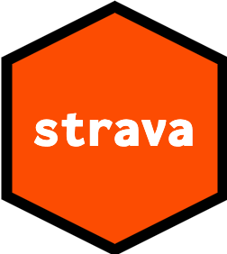

<!-- README.md is generated from README.Rmd. Please edit that file -->

# strava 

<!-- badges: start -->

[](https://github.com/tyluRp/strava/actions/workflows/R-CMD-check.yaml)
<!-- badges: end -->

The goal of strava is to access the strava API from R.

## Getting started

Create an API application from your personal strava account, read more
here: <https://developers.strava.com/docs/getting-started/>

Then store the following credentials in your `.Renviron` file that you
can find with `usethis::edit_r_environ`:

-   `STRAVA_ID`
-   `STRAVA_SECRET`

Refresh your R session and make a request:

``` r
library(strava)

# can only authenticate in interactive session
if (interactive()) 
  get_gear()

# an example response of the above request would be:
strava_data$gear
#> $id
#> [1] "b10826293"
#> 
#> $primary
#> [1] TRUE
#> 
#> $name
#> [1] "Roubaix"
#> 
#> $nickname
#> [1] "Roubaix"
#> 
#> $resource_state
#> [1] 3
#> 
#> $retired
#> [1] FALSE
#> 
#> $distance
#> [1] 537801
#> 
#> $converted_distance
#> [1] 334.2
#> 
#> $brand_name
#> [1] "Specialized"
#> 
#> $model_name
#> [1] "Roubaix"
#> 
#> $frame_type
#> [1] 3
#> 
#> $description
#> NULL
#> 
#> $weight
#> [1] 20
#> 
#> attr(,"class")
#> [1] "strava_gear" "list"
```

The first time you make a request, you will be asked to authorize. After
authorization, the token will be cached in memory for future requests in
the current session.

## Tidy responses

Most responses from the `get_` family of functions have a *tidy*
procedure that attempts to flatten the response into a table.

``` r
tidy(strava_data$gear)
#> # A tibble: 1 × 12
#>   id     primary name  nickname resource_state retired distance converted_dista…
#>   <chr>  <chr>   <chr> <chr>    <chr>          <chr>   <chr>    <chr>           
#> 1 b1082… TRUE    Roub… Roubaix  3              FALSE   537801   334.2           
#> # … with 4 more variables: brand_name <chr>, model_name <chr>,
#> #   frame_type <chr>, weight <chr>
```
